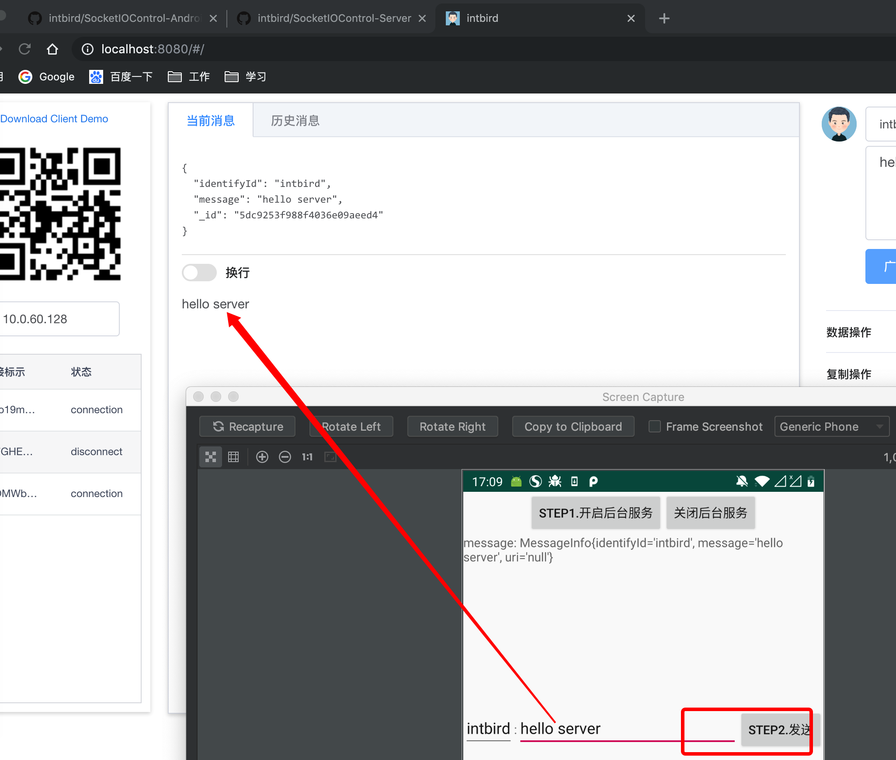
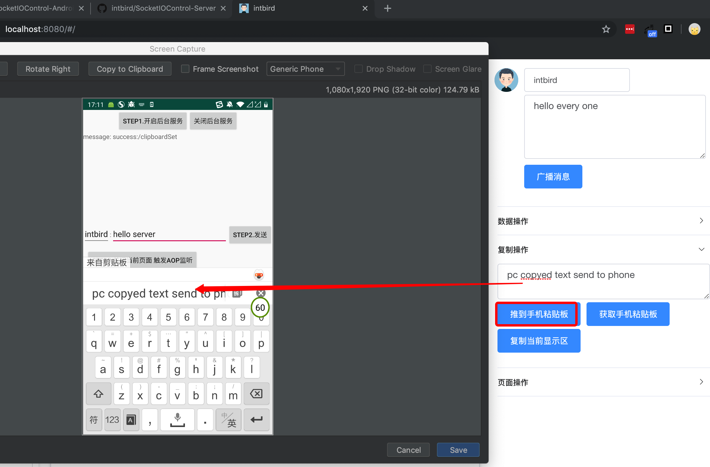
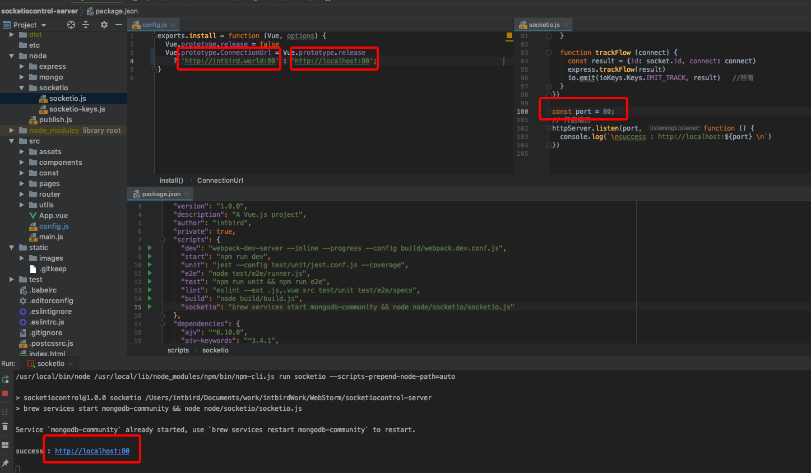
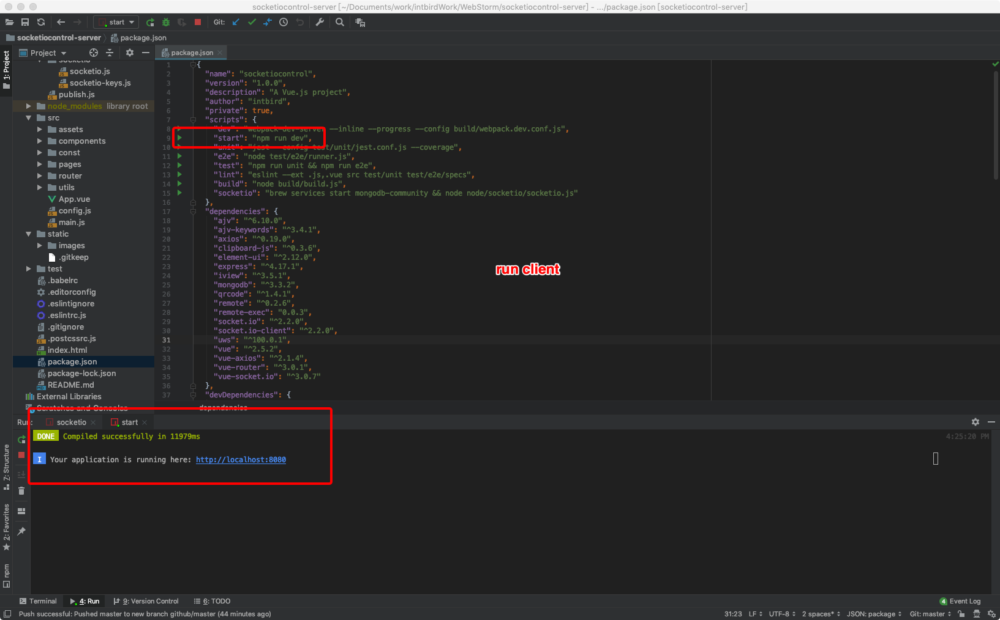
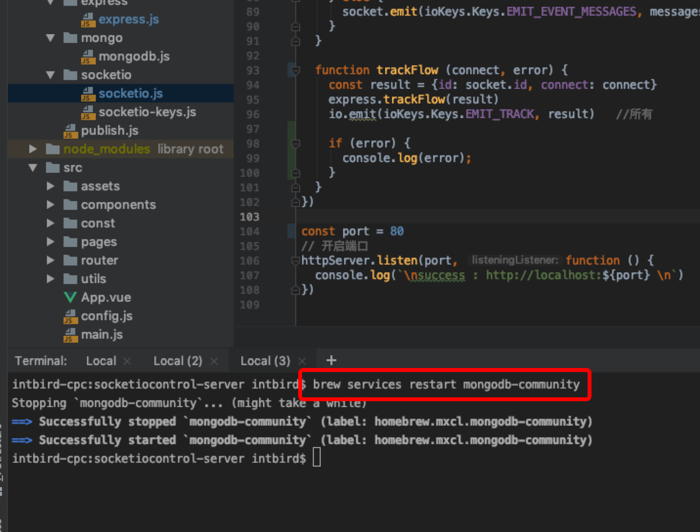
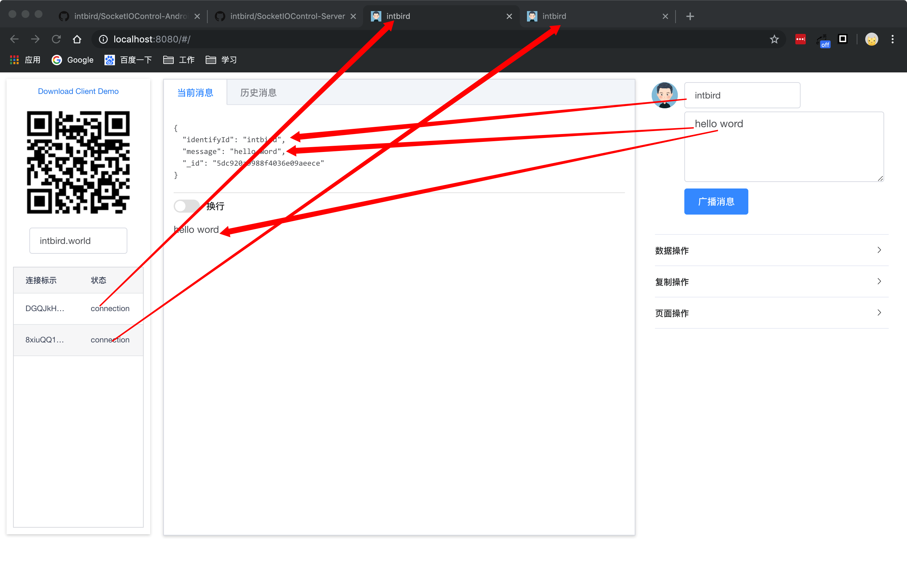
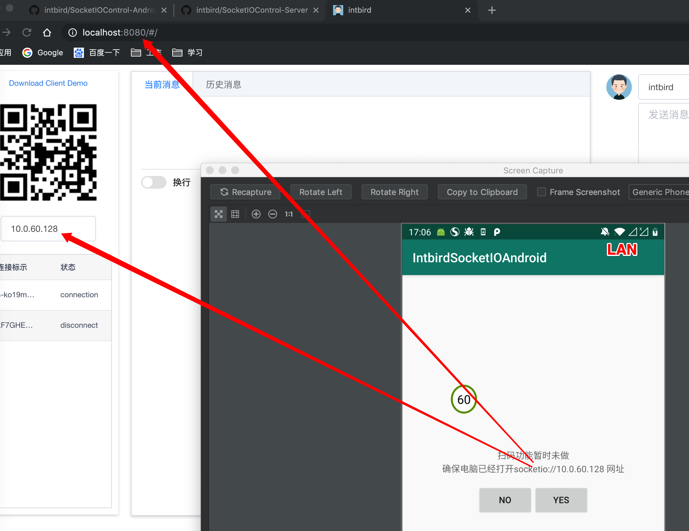
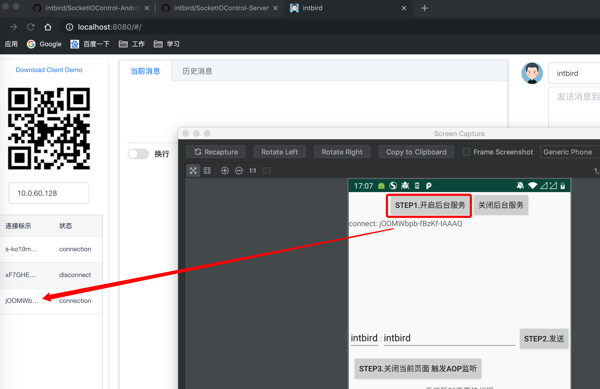
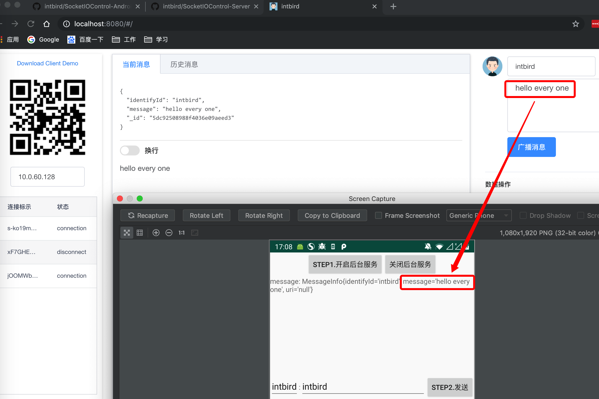
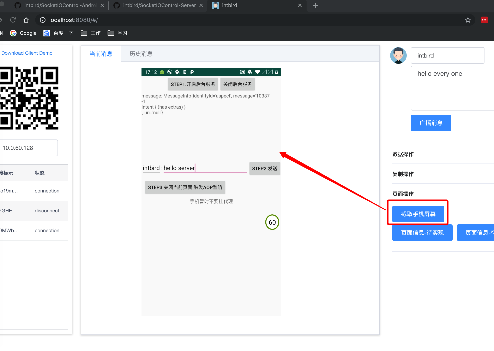

# socketiocontrol-server

> this repo is `no longer update` at time: 2020-05-15  
> and new repo is here:  
> [https://github.com/intbird/intbird](https://github.com/intbird/intbird)

>
>`已升级为https,证书不会上传`  
>here will tell you how to update your website use https:  
[Centos7 letsencrypt ssl 证书](https://blog.csdn.net/intbird/article/details/105159462)

------

# 1. website:
 https://intbird.world/

## 2. socket web url :
   https://intbird.world/#/socketio

## 3. socket server path:
   https://intbird.world:996

# 4. repo migrate:
this repo is `no longer update` at time: 2020-05-15  
and new repo is here:  
[https://github.com/intbird/intbird](https://github.com/intbird/intbird)
------
# run
#### install dependencies
npm install

#### start socketio server
npm run socketio-server

#### serve with hot reload at localhost:8080
npm run dev

------

# key function
###### 1. phone send message to pc or pc send message to phone

###### 2. push text to phone clipboard or get phone clipboard

###### 3. developing...
such as use MQ to send message queue ...   
new repo: 
[https://github.com/intbird/intbird](https://github.com/intbird/intbird)

--------

###### 4. screen shots

